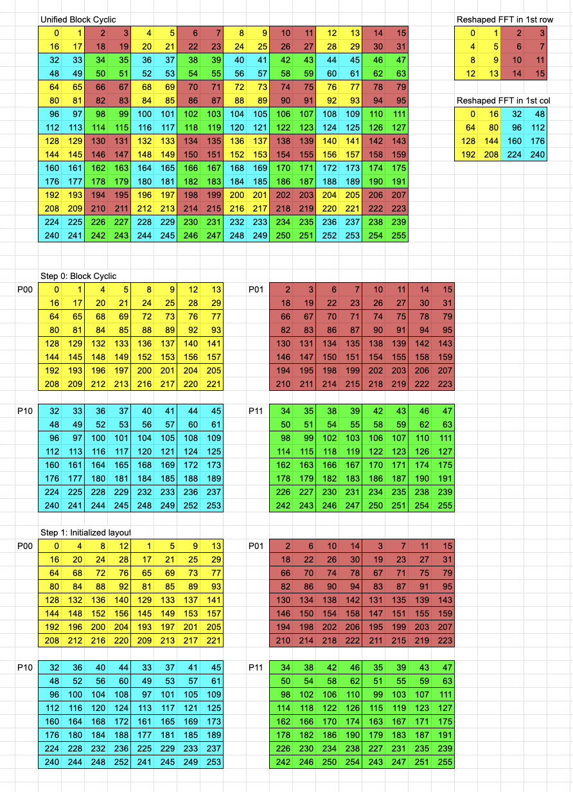
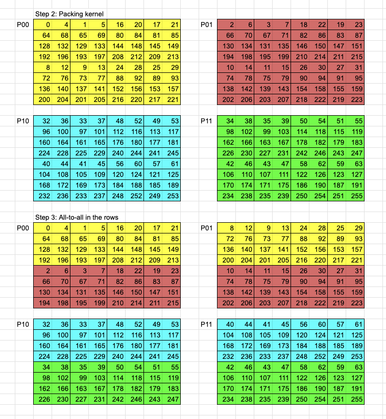
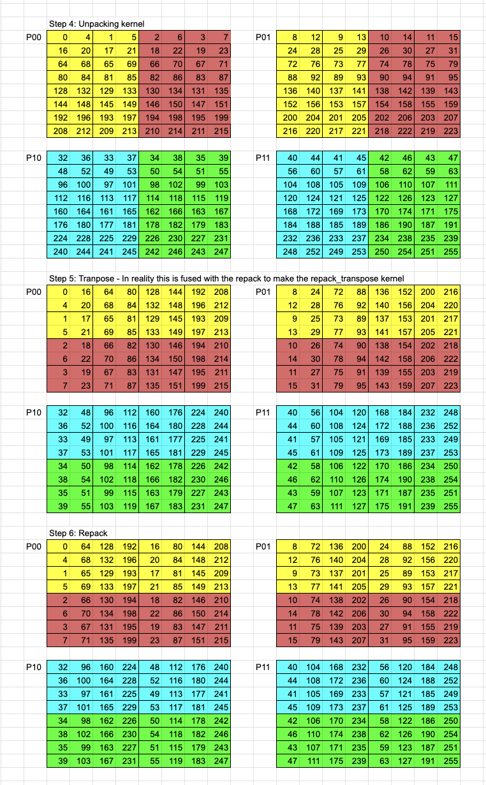

This repository contains an implementation of the interleaved block cyclic data distribution which can be used for high performance distributed FFTs and Stencils.  This repo uses MPI and CUDA.

This is research code.  It is set up for benchmarking on the CMU ECE number cluster and on NERSC Perlmutter.  For detailed benchmarking instructions see `benchmark.md`.  For an example of how the code would be used in an application see `example()` in `zmodel/main.cu`.

# Interleaved Block Cyclic

This is a brief explanation of the interleaved block cyclic distribution and its application to the 2D FFT. 

We start with a block cyclic distribution and then pack the ith element of all the blocks in a row together into vectors.  These vectors can be seen in Step 1 and is where we apply stencils.  Note that the elements in these vectors are independent and can be thought of as abstract SIMD vectors.

The 2D FFT is implemented as 2 independent 1D FFTs which we will call FFT1 and FFT2 respectively.  FFT1 is done in the rows of the original matrix while FFT2 is done in the columns of the original matrix.  FFT1 and FFT2 are further decomposed into two 1D FFTs each with twiddle factors applied in between in accordance with Cooley-Tukey.  The decomposition of FFT1 in the first row and FFT2 in the first column can be seen in the top right corner.  The row and column vectors are reshaped as matricies in accordance with the decomposition.  FFT1 is decomposed into FFT1a which is done in the columns of the new matrix and FFT1b which is done in the rows of the new matrix.  Note that the vectors we have packed in Step 1 are exactly the data needed to execute FFT1a.

From here we must split the vectors in P_DIM components and pack them for the All-to-All in the rows.  After the All-to-All in the rows the data is unpacked and we apply FFT1B.  Twiddles are applied during the unpack kernel.  The data for FFT1B is interleaved and is executed as batch FFT.  In reality we are doing a batch of batch FFTs which is not supported by traditional FFT libraries and is why we use CuFFTdx.

At this point we then perform a repack-transpose which is a transpose fused with our original interleaving of the blocks.  This allows us to reuse the same kernels from FFT1 for FFT2.  Note that Cooley-Tukey requries a transpose between FFTXa and FFTXb which we do not implement.  This does not effect correctness but results in two layers of interleaving in the reciprocal space.  In order to help users apply elementwise operators in the reciprocal space there are indexing functions in `./zmodel/utils.h` which will convert a real space global index to a local reciprocal space index and vice versa.

# How to use

This codebase requires MPI, CUDA, CuFFT, and (if you want good performance) cuFFTdx.

Code for the 2D fft impelmentation can be found in `./zmodel/transforms/fft.cu`.
Code for the 5-point laplacian can be found in `./zmodel/stencils/laplace.cu`. 3D versions can be found in `./zmodel/transforms/fft3d.cu` and `./zmodel/stencils/laplace3d.cu` respectively.  These can be run by modifying `./zmodel/main.cu` to run the appropriate test and using `make zmodel`.

`./zmodel/utils.h` contains default parameters and allows you to change the problem size or the number of processors used.  If you want to change the number of processors you will also have to update the Makefile to launch the correct number of processes.  N_DIM is the dimension of the total problem size which means in the 2D case there are N_DIM * N_DIM elements which are split across P_DIM * P_DIM processors and blocks are of size B_DIM * B_DIM.

The code can be run without cuFFTdx by disabling the correct Macros in `./zmodel/utils.h`. cuFFTdx can be installed at https://developer.nvidia.com/cufftdx-downloads.  You will need to replace the `FFTDX_INCLUDE` path in the Makefile.  Note that using this makes the compile times slow.

There are constraints on the values of B_DIM given P_DIM and N_DIM which will be detailed further in the future paper.

Please direct all questions to cjstange@andrew.cmu.edu